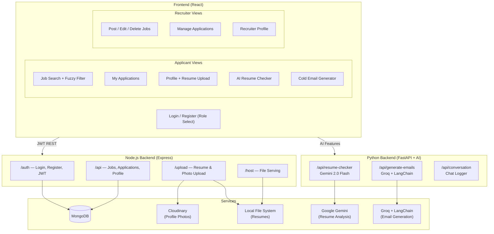

# 💼 Job Portal

A MERN stack job portal with **AI-powered features** — resume analysis, ATS scoring, and cold email generation. Supports two user roles: **Applicants** and **Recruiters**, with persistent login sessions and JWT-secured REST APIs.

---

## 🏗️ Architecture



---

## ✨ Features

### 👤 Applicant Features
- **Job Search** — Browse jobs with fuzzy search and filters (type, salary, duration, skills)
- **Apply for Jobs** — Submit application with a Statement of Purpose (SOP)
- **Application Tracking** — View status of all submitted applications
- **Resume Upload** — Upload and manage resume (PDF)
- **Profile Photo** — Upload profile picture (Cloudinary)
- **AI Resume Checker** — Upload resume (PDF) + optional job description → get instant AI feedback:
  - Quick Scan (3 strengths, 2 improvements, ATS score)
  - Detailed Analysis (section-by-section review, 5 dimensions scored out of 10)
  - ATS Optimization (keyword analysis, tailoring advice, ATS compatibility score)
- **Cold Email Generator** — Paste a job listing URL + upload your resume → AI generates a personalized cold email per role found on the page

### 🏢 Recruiter Features
- **Post Jobs** — Create job listings with title, description, type, salary, skills, duration
- **Manage Applications** — View all applicants, shortlist, accept, or reject applications
- **View Resumes** — Download and review applicant resumes
- **Profile Management** — Update recruiter profile and company info

### 🔐 Authentication
- Role-based registration: **Applicant** or **Recruiter**
- JWT token authentication (`jsonwebtoken` + Passport.js)
- Password hashing with `bcrypt`
- Persistent login sessions

---

## 🛠️ Tech Stack

### Frontend
| Tool | Purpose |
|---|---|
| React (CRA) | UI framework |
| Material UI | Component library |
| React Router | Client-side routing |
| Axios | HTTP client |

### Node.js Backend
| Tool | Purpose |
|---|---|
| Node.js + Express | REST API server |
| Mongoose + MongoDB | Database ORM + storage |
| Passport.js + JWT | Authentication |
| bcrypt | Password hashing |
| multer | File upload (resumes) |
| Cloudinary | Profile photo storage |
| nodemailer | Email support |

### Python AI Backend
| Tool | Purpose |
|---|---|
| FastAPI + Uvicorn | AI API server (port 8000) |
| Google Gemini 2.0 Flash | Resume analysis & ATS scoring |
| Groq + LangChain | Job extraction & cold email generation |
| PyPDF2 / python-docx | Resume text extraction |
| LangChain WebBaseLoader | Job listing page scraping |

---

## 📁 Project Structure

```
job-portal-internship/
├── backend/
│   ├── routes/
│   │   ├── authRoutes.js      # Login, register, JWT
│   │   ├── apiRoutes.js       # Jobs, applications, profile CRUD
│   │   ├── uploadRoutes.js    # Resume & photo upload
│   │   └── downloadRoutes.js  # File serving
│   ├── db/                    # Mongoose models
│   ├── lib/                   # Passport config, helpers
│   ├── server.js              # Express app entry point (port 4444)
│   ├── app.py                 # FastAPI AI server (port 8000)
│   ├── chains.py              # LangChain chains (job extraction, email writing)
│   ├── resume_parser.py       # Groq-powered resume skill/experience extractor
│   ├── utils.py               # Text cleaning, file extraction helpers
│   └── requirements.txt       # Python dependencies
├── frontend/
│   └── src/
│       ├── component/         # Applicant-specific views
│       ├── components/        # Recruiter & shared views
│       ├── context/           # Auth context
│       ├── lib/               # API helpers
│       └── App.js             # Routes & role-based rendering
└── README.md
```

---

## 🚀 Getting Started

### Prerequisites
- [Node.js](https://nodejs.org/) v16+ + Yarn
- [Python](https://www.python.org/) v3.9+
- [MongoDB](https://www.mongodb.com/) (local or Atlas)

### Node.js Backend (Port 4444)

```bash
cd backend
yarn install
```

Create `.env` in `backend/`:
```env
mongo_url=your_mongodb_connection_string
JWT_SECRET=your_jwt_secret
CLOUDINARY_CLOUD_NAME=your_name
CLOUDINARY_API_KEY=your_key
CLOUDINARY_API_SECRET=your_secret
port=4444
```

```bash
yarn dev    # development
yarn start  # production
```

### Python AI Backend (Port 8000)

```bash
cd backend
pip install -r requirements.txt
```

Add to `.env`:
```env
GOOGLE_API_KEY=your_gemini_api_key
GROQ_API_KEY=your_groq_api_key
```

```bash
python app.py
```

### Frontend (Port 3000)

```bash
cd frontend
yarn install
yarn start
```

---

## 🔌 API Endpoints Overview

### Node.js Server (`http://localhost:4444`)

| Route Prefix | Description |
|---|---|
| `/auth` | Register (applicant/recruiter), login, JWT |
| `/api` | Jobs CRUD, applications, profile management |
| `/upload` | Resume PDF and profile photo upload |
| `/host` | Serve uploaded files (resumes, photos) |

### Python AI Server (`http://localhost:8000`)

| Endpoint | Description |
|---|---|
| `POST /api/resume-checker` | Analyse PDF resume; quick/detailed/ATS modes |
| `POST /api/generate-emails` | Scrape job URL + parse resume → cold emails |
| `POST /api/conversation` | Append to conversation log |

---

## 📄 License

MIT License — see [LICENSE](LICENSE)
